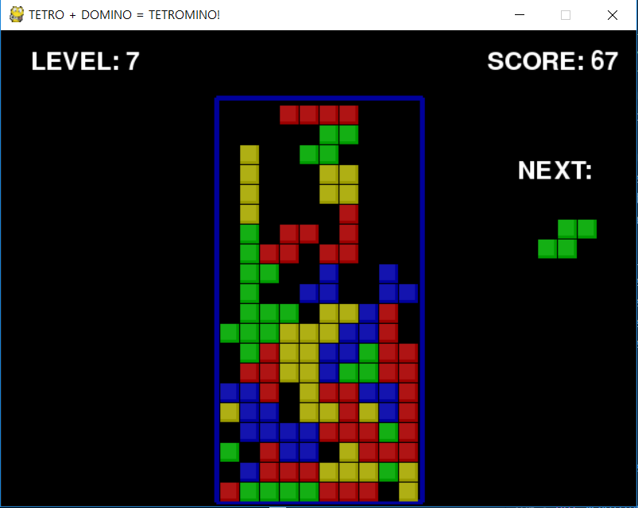

## 1. Instruction

-   **screen input/output**
    

<br><br>

## 2. Algorothm

-   rules : blocks are consists with '1' or '0'
-   calculate forward and check bits over '1'
-   if collided, there's bit over '1'
    1.  one step backward and fix [__field__]
    2.  fix filed
-   if not, 1step forward and check, repeatedly

<br><br>

## 3. Coding

-   **functions**

    1.  check block forward

    ```python
    while True:
        if fallingPiece == None:
            # get New PIECES
            fallingPiece    = nextPiece
            nextPiece       = getNewPiece()
            lastFallTime    = time.time()   
            # reset lastFallTime AGAIN~!!

            if not isValidPosition(board, fallingPiece):
                return      
            # Not able to set New PIECES = GAME OVER.

        checkForQuit()

        for event in pygame.event.get():
            if event.type == KEYUP:             # Release - EVENT LOOP
                if (event.key == K_p):          # p-key is released
                    # PAUSE MODE = PRESS 'P'
                    DISPLAYSURF.fill(BGCOLOR)
                    pygame.mixer.music.stop()
                    showTextScreen('Paused')

                    pygame.mixer.music.play(-1, 0.0)

                    lastFallTime            = time.time()
                    lastMoveDownTime        = time.time()
                    lastMoveSidewaysTime    = time.time()
    ```
